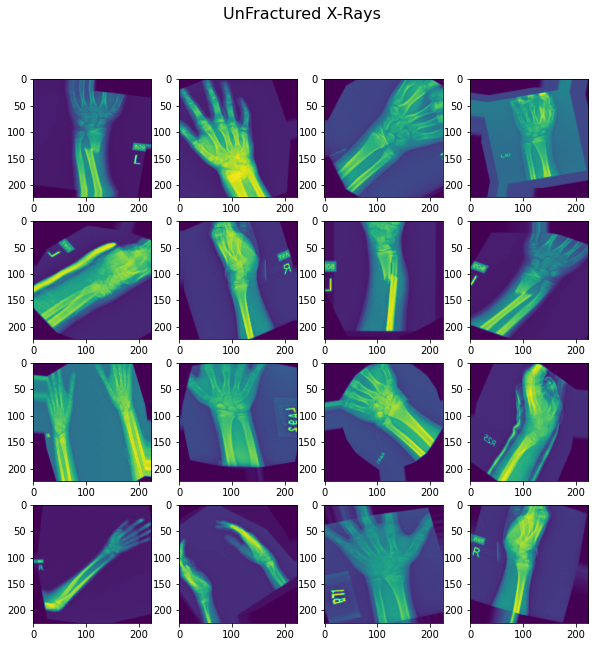
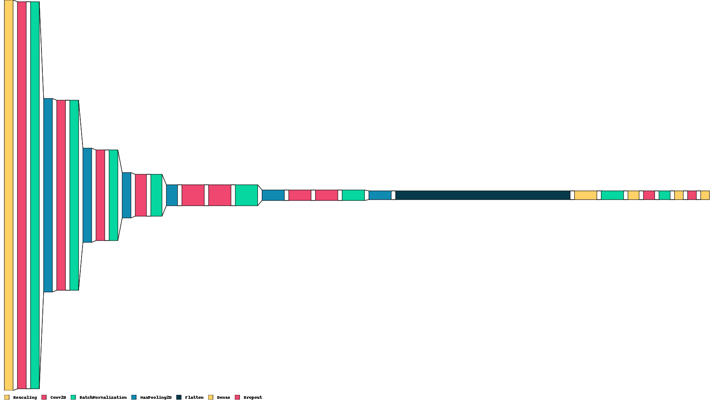
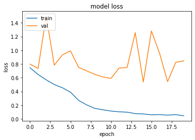

# X-Ray-Bone-Classifier

## Summary
This project creates a model architecture for a Convolutional Neural Network that could predict whether an X-ray Image showed a Fractured or UnFractured Bone. Training accuracy of 99% & 98% and Validation accuracy of 74.2% & 77.8% were obtained respectively from the 2 models generated. 

## Dataset
The Dataset was provided off VUPPALA ADITHYA SAIRAM on Kaggle (https://www.kaggle.com/datasets/vuppalaadithyasairam/bone-fracture-detection-using-xrays).
Data was already split into Training and Validation set, with each one containing a roughly equal number of fractured and nonfractured X-ray images. Within each folder, there are a series of images along with their variants rotated in the third dimension. 
Images are 224 by 224 pixels in size.   

## Methodology

Initial code was adapted from the Dataset author VUPPALA ADITHYA SAIRAM's baseline code. Inspiration was taken for Preprocessing and developing Hypertuning parameters. 

### Preprocessing
 - Due to the relatively small size of the dataset provided, Data Augmentation was introduced to provide more robustness to the model. The Image-inputs generated from the Dataset are changed via the ImageDataGenerator object 'image_datagen'. Rotation, shear, zoom, flip, and height/width transformations are all altered in the Dataset to provide more variance and improve the model's ability to generalize. 
 
### Model Architecture
 - After Inputting the Image data, a Rescaling Layer is applied to scale the rbg data values down from 0-255 to a float value between 0-1. This normalization of data is seen throughout the Model through Batch Normalization Layers to prevent previously observed internal covariate shifts and vanishing/exploding gradients. 
 - Convolution Layers with Pooling Layers are applied to extract image features. General kernal_size of 3x3 was used, along with the rectified linear activation function.
 - After a flattening layer, a series of fully connected layers are used to extrapolate to an eventually classification (Fractured or not). 
 - Dropout was interwoven within the fully-connected layers to introduce variance and encourage more use of all the nodes. 
 

### Training
 - Data was trained using Binary-CrossEntropy as the loss function and the Adam optimizer. 
 - Hyperparameters were tuned using 2 types of callbacks.
    - ModelCheckpoint - saves the best model based on validation accuracy while training. This way, we have access to a model that wouldn't be overfit if the epochs are too large
    - Reduce LR on Plataeu - reduces the learning rate by 10% if the validation loss doesn't decrease after 20% of the total number of epochs. This will help stablize a node and prevent increased change from new backpropagation. 

## Validation
 - Running the best model (saved from ModelCheckpoint) and the complete model (saved at the end of running all epochs) returns an accuracy on the validation dataset of 77.8% and 74.2% respectively. 
 - Running the models on the training dataset returns 98%-99% accuracy, indicating some degree of overfitting. 
 
 

## Potential Next Steps For this Project
 - Implement Cross-Validation as another marker to judge model efficacy.
 - Tune more HyperParameters to prevent overfitting, such as:
   -  Add/Modify/Remove Layers to further improve accuracy.
   -  Adding L1 or L2 Regularization Layers
   -  Modifying the Kernel sizes (i.e. 5x5)
